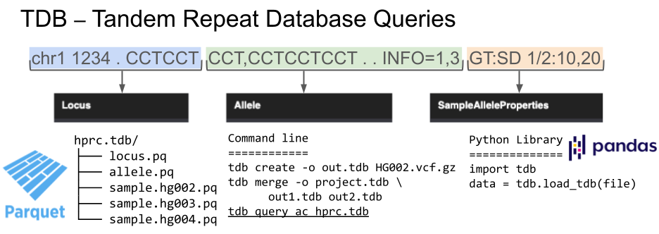

# TDB: Tandem Repeat Database Queries
 

Tandem Repeats Team -- 2024 SVCC Hackathon

- Bishnu Adhikari
- Wouter De Coaster
- Adam English
- Emrah Kacar
- Rupesh Kesharwani
- Natali Gulbahce
- Moustafa Shokrof

Introduction
============
Our project’s ideas are around [tdb](https://github.com/ACEnglish/tdb). This tool turns ‘REPL’ style VCFs from tandem repeat callers into a database. This database compresses better than a VCF thanks to the parquet format and has better structured data that is easier to parse than VCFs. There are currently a handful of ‘standard’ queries and analysis notebooks which can provide useful summaries of tandem repeat results. For the hackathon, we can make some new, interesting queries.



Data
====
HPRC 105 TDB made as part of the Human Pangenome Reference Consortium (HPRC) which represents a subset of HPRC and presents genomic diversity across 105 indivuduals (https://www.nature.com/articles/s41587-023-02057-3).

- Total Samples: 105
- Total TR loci: 937,122 
- Total TR span: 121,698,022 bp (4% of grch38)
- TR catalog: [Adotto v0.3](https://zenodo.org/records/7226352)

| Population | Count |
|------------|-------|
| AFR        | 52    |
| AMR        | 56    |
| EAS        | 32    |
| SAS        | 48    |
| UNK        | 8     |

Result #1 - GTF annotation
==========================

The script `Emrah_EDA/tdb_gtf_anno.py` will annotate the TR loci with gene information in a gtf such as [this from
gencode](https://ftp.ebi.ac.uk/pub/databases/gencode/Gencode_human/release_38/gencode.v38.annotation.gtf.gz`).

### Example Usage
```
python tdb_gtf_anno.py \
    hprc_105.tdb \
    gencode.v38.annotation.gtf.gz > output.txt
```
You can optionally subset to specific loci with `--locusids` or tdb chromosomes with `--chrom`.

Example output:
```
LocusID	hits_gene	hits_exon	gene_name
132443	True	False	KIAA1549L
271491	False	False
347074	True	False	CCDC200
347381	False	False
385018	True	False	GTSCR1
396168	True	False	ZNF433-AS1,CTC-359D24.6
453703	True	True	TMEM87B
520559	False	False
585194	True	False	PIK3CB
```

Result #2 - Population Statistics
=================================

### Allele Counts
To annotate made the allele counts  `English_EDA/population_ac_by_length.py`

Usage:
```
python population_ac_by_length.py \
    hprc_105.tdb metadata.tsv -o result.txt
```

Example output:
```
chrom	start	end	is_ref	AC	AF	AC_EAS	AC_AMR	AC_AFR	AC_SAS	AC_UNK
chr1	72059	72194	True	145	0.7474226804123711	15	24	22	19	8
chr1	72059	72194	False	11	0.05670103092783505	1	0	1	8	0
```
## Length polymorphism
The length polymorphism score is a per-locus measure of the proportion of distinct alleles by length over the total
alleles measured at a locus

Usage:
```
tdb query len_poly_score hprc_105.tdb > result.txt
```

Example output:
```
chrom	start	end	len_poly_score
chr1	16682	16774	1.9047619047619047
chr1	19275	19473	1.9047619047619047
chr1	20798	20893	1.9047619047619047
```

## Fst
[Fixation index (Fst)](https://en.wikipedia.org/wiki/Fixation_index) is a measure of genetic differentiation between populations, quantifying the proportion of genetic variance due to population structure. Here we calculated Fst of TR alleles across loci, we first run a query to calculate allele counts by population using population_ac_by_length.py to create input_allele_counts.tsv. We use an equation from [Joshua Sampson et al. (2012)](https://www.ncbi.nlm.nih.gov/pmc/articles/PMC3141729/#APP1title).


Usage:
```
python calculate_fst.py -o result.tsv input_allele_counts.tsv 
```

Example output:
```
 chrom   start   end     is_ref  AC      AF      AC_EAS  AC_AMR  AC_AFR  AC_SAS  fst     fst_SAS_EAS     fst_SAS_AMR     fst_SAS_AFR     fst_EAS_AMR      fst_EAS_AFR     fst_AMR_AFR
0       chr1    16682   16774   True    161     0.8563829787234043      16      28      26      24      0.0032071247201271857   0.0     0.00073260073260073      0.004571428571428449    0.0006734006734007147   0.004186289900575568    0.0016737559221220444
1       chr1    16682   16774   False   27      0.1436170212765957      4       8       9       6       0.0032071247201269637   0.0     0.00073260073260073      0.004571428571428449    0.0006734006734007147   0.004186289900575457    0.0016737559221218223
2       chr1    19275   19473   True    178     0.946808510638298       16      28      26      24      0.0770754352030949      0.015999999999999903    0.0034188034188034067    0.061103030303030215    0.024242424242424176    0.08080808080808077     0.0430976430976433
```


Result #3 - Population Informative TR Loci
==========================================

See [this notebook](https://github.com/collaborativebioinformatics/tandemrepeats/blob/main/English_EDA/MainNotebook.ipynb) for details.

