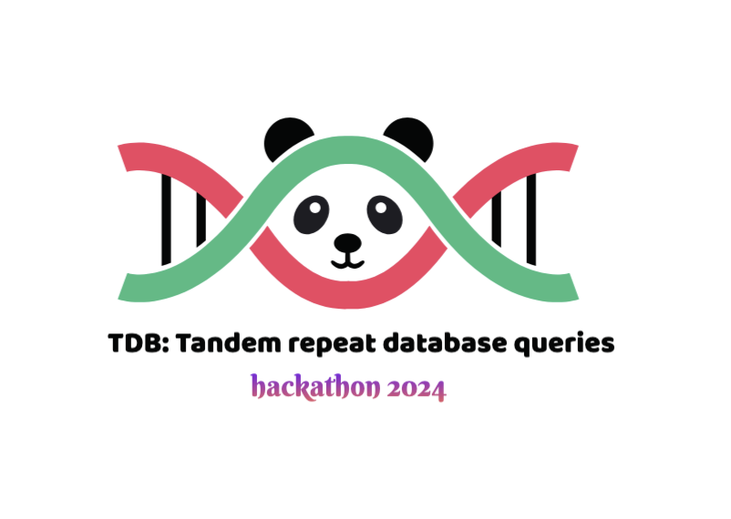

# TDB: Tandom Repeat Database Queries



Tandem Repeats Team -- 2024 SVCC Hackathon

- Bishnu Adhikari
- Wouter De Coaster
- Adam English
- Emrah Kacar
- Rupesh Kesharwani
- Natali Gulbahce
- Moustafa Shokrof

Introduction
============
Our project’s ideas are around tdb (https://github.com/ACEnglish/tdb/tree/main). This tool turns ‘REPL’ style VCFs from tandem repeat callers into a database. This database compresses better than a VCF thanks to the parquet format and has better structured data that is easier to parse than VCFs. There are currently a handful of ‘standard’ queries and analysis notebooks which can provide useful summaries of tandem repeat results. For the hackathon, we can make some new, interesting queries.


Data
====
Quick description of HPRC 105 TDB

Result #1 - GTF annotation
==========================

The script `Emrah_EDA/tdb_gtf_anno.py` will annotate the TR loci with gene information in a gtf such as [this from
gencode](https://ftp.ebi.ac.uk/pub/databases/gencode/Gencode_human/release_38/gencode.v38.annotation.gtf.gz`).

### Example Usage
```
python Emrah_EDA/tdb_gtf_anno.py hprc_105.tdb gencode.v38.annotation.gtf.gz --chrom chr20 > output.txt
LocusID	hits_gene	hits_exon
494054	True	False
494053	True	True
```

TODO! Summary of gene intersection


Result #2 - Fst
===============
To annotate made the [Fixation index (Fst)](https://en.wikipedia.org/wiki/Fixation_index) of TR alleles across loci

Usage:
TODO! Turn this into a tool with example usage. And make a summary of Fst distribution or something.

Result #3 - Population Informative TR Loci
==========================================
The overall PCA of the hprc_105 database shows:


We explored if it is possible to find a subset of TR loci that could generate an equivalent amount of separation by
population in a PCA.

See [this notebook](https://github.com/collaborativebioinformatics/tandemrepeats/blob/main/English_EDA/MainNotebook.ipynb) for details.


# Daily Updates 


Old-Background
===========

For a tutorial on using tdb for programmatic access, see Introduction notebook. The motivation for tdb was that TRs can be better represented as ‘replacements’ of reference sequence spans with contracted/expanded alternate allele sequence. This type of representation removes alignment ambiguities, which TRs are highly susceptible to. Furthermore, VCFs are not a normalized data structure. Each ‘row’ in a VCF can hold multiple alleles and multiple samples. This, combined with the mixed data-types, makes parsing VCF files… unpleasant.  The tdb is a normalized database with three tables with information on loci, alleles, and samples. The data can be parsed by standard data science libraries, such as pandas, with ease.

Old-Query #1 - Population Structure – Moustafa, Natali
--------------
There is already a population structure notebook which will identify loci with >= 20 alleles and plot a clustermap of how similar samples’ alleles are. This comes with a clustering that - at least in the hprc example data - reconstructs the population structure pretty well. We can refine this query by:
Improving the selection of loci: Is just >=20 alleles sufficient or could we leverage length/sequence polymorphism queries to get a more informative set of loci?
Improving reporting of population structure: The clustermap is cool, but that’s not parsable. Writing a “Sample->ClusterID”, could be more informative.
Could this query be expanded to perform a TR-specific kinship analysis similar to plink’s kinship? Could a subset of TRs be as powerful (more powerful??) as genome-wide SNPs?

Old-Query #2 - PCA
--------------
Similar to the population structure, there is already an example notebook which will perform a PCA on a tdb. This could be improved. This could also be expanded to perform PCA on methylation data. There may be population structures to dna methylation data. If we can show that they line up to dna variants’ population structure would be neat.

Old-Query #3 - Length Outliers – Bishnu, Adam
--------------
Again, there is an example notebook for finding TR alleles which have an anomalous length. There are other approaches which work to find length outliers. A comprehensive single report of all of these measures would assist researchers in prioritizing tandem repeats.

Old-Query #4 - TR Structure  – Wouter
--------------
Given the multiple TR alleles over a locus, we can annotate the TR motifs on each sequence and perform an MSA. We can then consolidate and create a ‘consensus’ structure of the repeats over the spans. This output should allow more detailed analysis of length outliers because we would no longer be just looking at the length of sequence over the locus but have motifs and copy numbers aligned across alleles. A light-weight notebook that leverages abpoa and tr-solve to build some of this information is already available. However, we’d want to replace tr-solve for annotating motifs. TRF is possible, but it will redundantly annotate spans which would make deconvolution of the repeat structure over multiple sequences difficult.

Old-Query #5 - TR Allele Merging
----------------------------

We're skipping this for now.

The alleles recorded in a tdb may differ by as little as 1bp. We can leverage Truvari to merge allele sequences which are over e.g. 98% size/sequence similar. If Query #4 is completed, we could provide a more precise merging by leveraging copy numbers of motifs over alleles instead of a broad similarity threshold which may sometimes ‘overmerge’ when the differences between alleles is small. For example, two alleles of 100 and 97bp are 97% similar, but if that 3bp difference is a copy of the CGG motif, we may not want to merge them. This work would start by simply leveraging truvari’s truvari.seqsim and `sizesim` methods to build a match matrix of sequences and then find the network of what alleles need to be kept and which need to be renumbered. Most of the matrix/collapsing code could be lifted from ‘simple_merging.py’ in the repo’s hackathon folder. The remaining work would be to update the allele numbers across the allele and sample tables before writing a new database. The main thing to keep in mind for updating the allele numbers is that allele number 0 must always be the reference allele.

An advanced merging approach could also take sequence context into consideration. For example, homopolymer runs can often have an increased error rate, so accounting for them could help find matching alleles.

Old-Query #6 - Mendelian Consistency, Putative denovo
-------------------------------------------------

We're skipping this for now.

Since TDB holds all alleles, it should be fairly straightforward to identify loci/alleles that are unique to a proband. Many of the ‘denovo’ sites will be due to technical errors and a full denovo analysis would likely need to leverage the original sequencing. However, a tdb query could help prioritize loci for further investigation.
Project data
We have an HPRC tdb with ~105 pacbio samples processed with TRGT available. For rapid development, there are functional test tdbs available in the repo.


